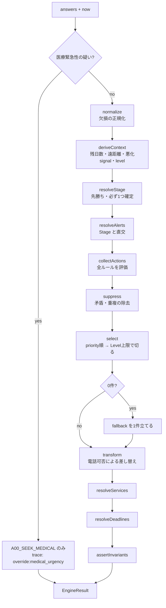
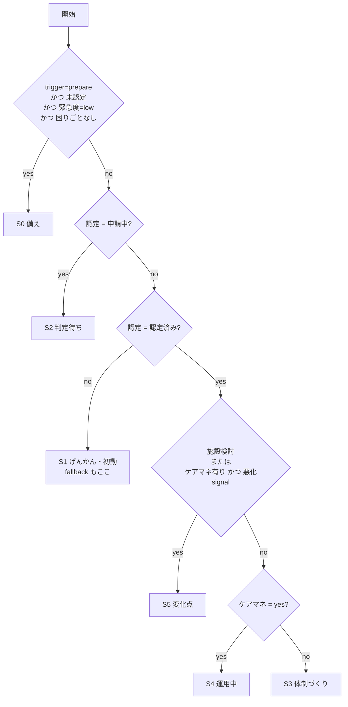
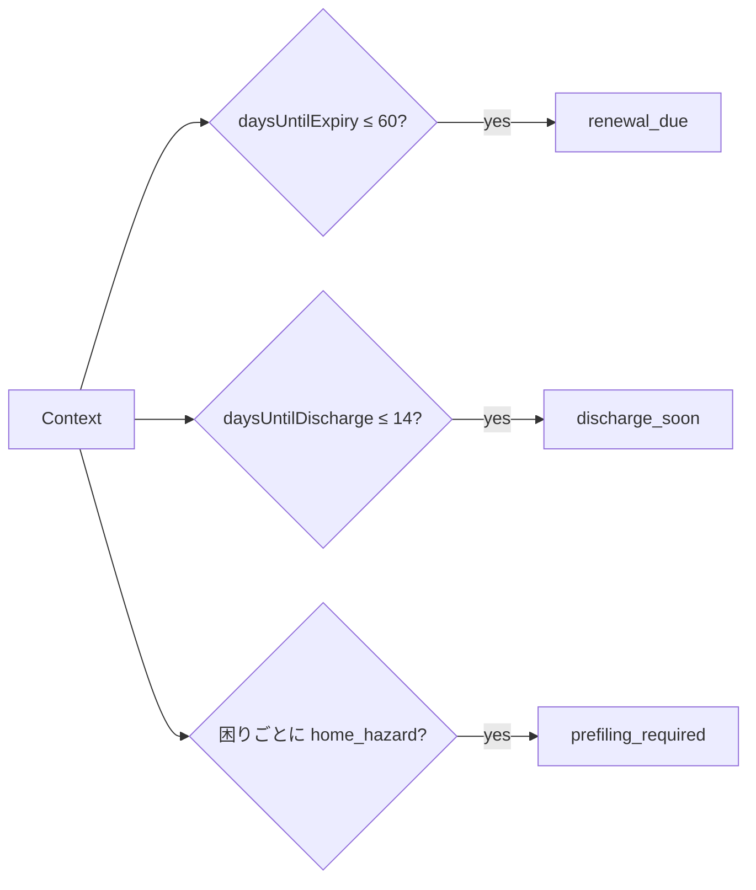
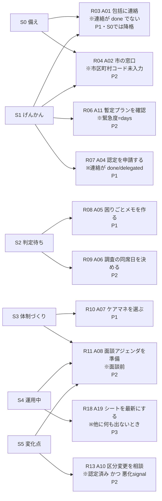
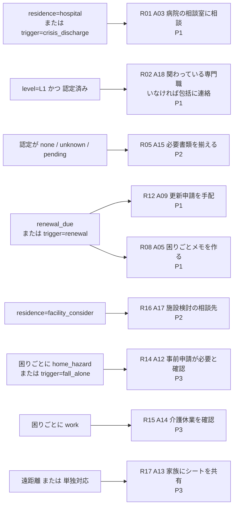
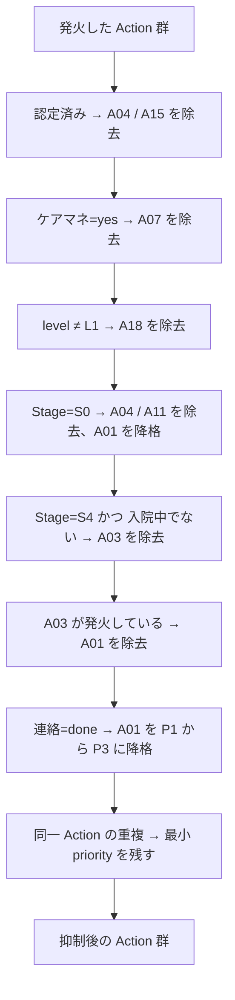
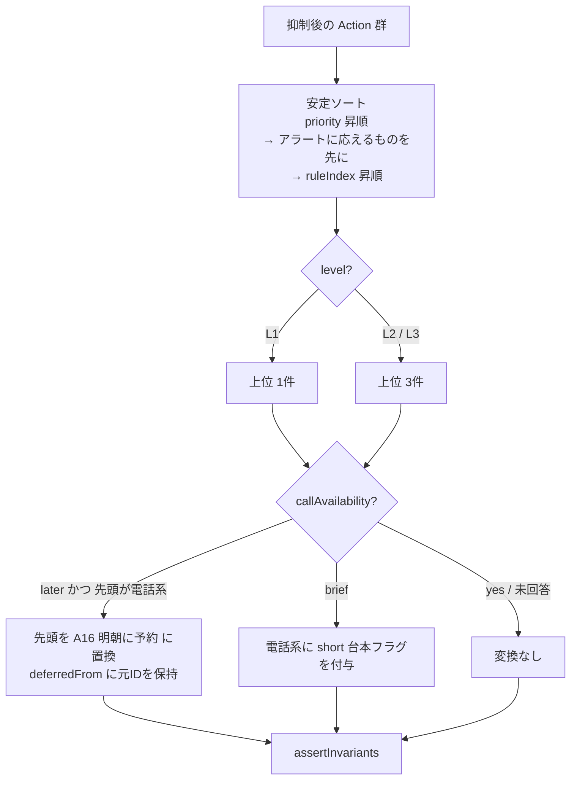
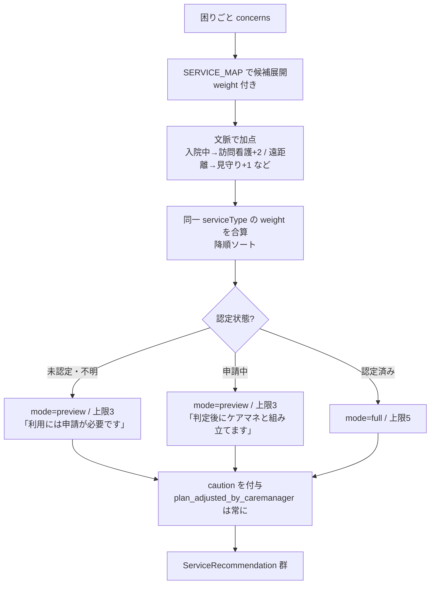
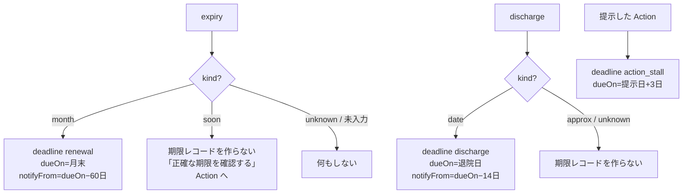
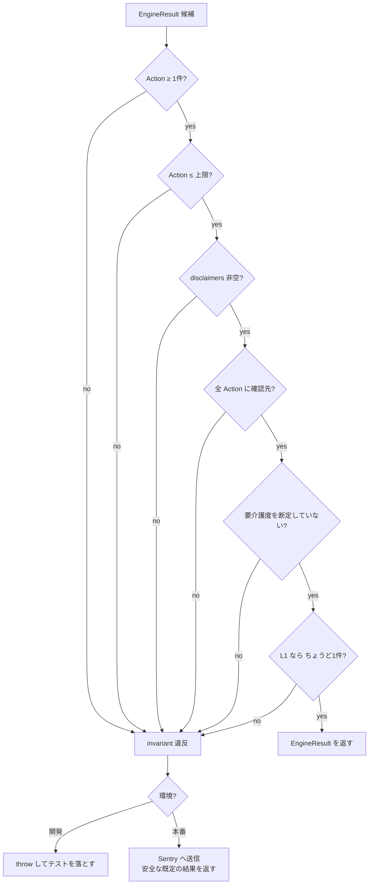

# 判断ロジック フローチャート: 介護のげんかん

**対象:** [ENGINE.md](./ENGINE.md) v0.1  
GitHub 上で Mermaid がそのまま描画される。

---

## 1. 全体パイプライン

医療緊急性のフラグが立ったら、介護フローに入る前に抜ける。

---

## 2. Stage 判定

先勝ち。どの入力でも必ず1つに落ちる。

読み方の注意:

- `認定 = unknown` は Q2 で no に落ち、**S1** になる。「不明なら初動として扱う」
- 認定済み・悪化signal あり・ケアマネなしは S5 ではなく **S3**。まず専門職につなぐのが先
- 施設検討はケアマネの有無を問わず **S5**

---

## 3. アラート判定（Stage と並行）

Stage が S4（運用中）でもアラートは立つ。**両方を同時に表示できる**のがこの分離の目的。

---

## 4. Stage が条件に入る Action

`A08` は S3・S4・S5 で共通。`A05` は S2 だけでなく `renewal_due` でも出る（更新でも認定調査があるため）。

---

## 5. Stage を問わない横断ルール

`A18` は L1 でしか出ない。ケアマネの有無が不明なとき、**どちらでも正しい一手**として機能させるための折衷。

---

## 6. 抑制フィルタ

分岐ではなく、順番に通していくフィルタ列。

**除去と降格を区別する。** 連絡済みでも状況が変われば再連絡は選択肢に残す。

A03 と A01 を並べない理由は、入院中の相手には病院の相談室が正しい入り口だから。両方に電話させるのは、この製品が消そうとしているノイズそのものになる。

---

## 7. 選択と変換

L1 で 1件に絞るのは「30秒で1手」という約束を守るため。ここを 3件にすると設計が崩れる。

---

## 8. サービス種別

認定前に具体的なサービスを前面化しない。**preview は選択肢の地図**に留める。

---

## 9. 期限抽出

`soon` は自己申告で日付が確定しないので、**推測日で通知しない**。ここで通知を飛ばすと信頼を落とす。

---

## 10. ガード

壊れた結果を表示するより、安全な既定を出す。

---

## 11. 代表ケースの経路

| ケース | Stage 経路 | 発火 → 抑制 → 選択 |
|---|---|---|
| A 遠方 × 物忘れ × 未申請 × 未連絡 | Q0 no → Q1 no → Q2 no → **S1** | R03 R05 R17 → 抑制なし → **A01 → A15 → A13** |
| B 退院近い × 未申請 × 緊急 × 今電話不可 | Q0 no → Q1 no → Q2 no → **S1** | R01 R03 R05 R06 → A03発火でA01除去 → **A16(A03) → A15 → A11** |
| C 認定あり × 更新間近 × ケアマネ有り | Q2 yes → Q3 no → Q4 yes → **S4** + `renewal_due` | R08 R12 → 抑制なし → **A09 → A05** |
| D 認定あり × ケアマネ無し × 入浴・段差 | Q2 yes → Q3 no → Q4 no → **S3** | R10 R11 R14 → 抑制なし → **A07 → A08 → A12** |
| E L1のみ × 認定あり | Q2 yes → Q3 no → Q4 no → **S3** | R02 R10 R11 → 上限1で切る → **A18 のみ1件** |

経路を追うと分かること:

- **B** は Stage は S1 のまま。`callAvailability=later` の変換で先頭だけが A16 に差し替わる
- **C** で A09 が A05 より先に来るのは、同じ P1 のなかで**アラートに応えるものを先に出す**というタイブレークが効いているから。ルール配列の順序（R08 → R12）だけだと逆順になる
- **E** は Stage が S3 でも、L1 なので A07 ではなく A18 が出る。ケアマネの有無を聞く前に「ケアマネを選べ」とは言わない
