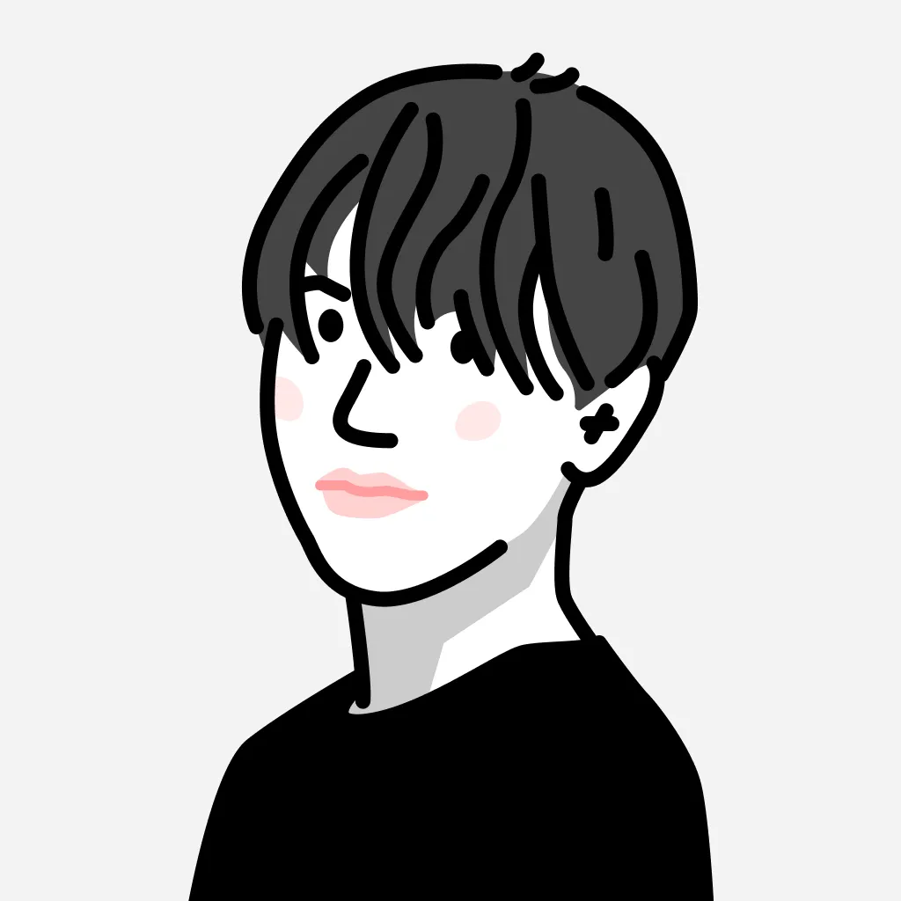

# 気持ちぃ〜角丸
# Squircles

---
class: hero
---

# どっちが
# 気持ちいい？

<div class="pair quiz">
  <div class="pair-item">
    <div class="shape round"></div>
    <span>左だと思う人！</span>
  </div>
  <div class="pair-item">
    <div class="shape squircle"></div>
    <span>右だと思う人！</span>
  </div>
</div>

---
class: hero
---

# コードは1行しか違わない

```css
corner-shape: squircle;
```

---

# 円弧は、角で曲率が跳ぶ

辺は直線。角は円。境目で曲率が跳ぶ。

---

# Squircle は、曲率が連続する

同じ大きさでも、角が溶ける。

---

# 角を丸めたいだけなのに

- SVG → サイズで破綻
- `clip-path` → `box-shadow` ごと消える

---
class: hero
---

# だから、CSS の角そのものを変えたい

---

# その1行

```css
border-radius: 24px;
corner-shape: squircle; /* = superellipse(2) */
```

上は今まで通り。下が新しい。

---

# 非対応では、今までの角丸に戻る

- Chromium 139+
- Safari / Firefox は未対応
- `@supports` 不要

---
class: hero
---

# 今夜、1行だけ

プロダクトの角に、足してみてください。

<div class="pair closing">
  <div class="shape round"></div>
  <div class="shape squircle"></div>
</div>

<!--
5分ベルの正規終了点。可能なら次へ。無理なら「続きは懇親会で」だけ言って降りる。
-->

---
class: hero
---

# 続きは懇親会で

n を動かすと、round から notch まで一本につながる。

---

# n を動かすだけ

<CornerSlider />

---

# キーワードは、n の別名

<div class="spectrum">
  <div class="spectrum-item">
    <div class="shape square"></div>
    <code>∞</code>
    <span>square</span>
  </div>
  <div class="spectrum-item">
    <div class="shape squircle"></div>
    <code>2</code>
    <span>squircle</span>
  </div>
  <div class="spectrum-item">
    <div class="shape round"></div>
    <code>1</code>
    <span>round</span>
  </div>
  <div class="spectrum-item">
    <div class="shape bevel"></div>
    <code>0</code>
    <span>bevel</span>
  </div>
  <div class="spectrum-item">
    <div class="shape scoop"></div>
    <code>-1</code>
    <span>scoop</span>
  </div>
</div>

---
class: hero
---

# 全部、この1本の数式の上に乗っている

---

# 負の値で、角が凹む

<div class="pair">
  <div class="pair-item">
    <div class="shape scoop"></div>
    <span>scoop</span>
  </div>
  <div class="pair-item">
    <div class="shape notch"></div>
    <span>notch</span>
  </div>
</div>

---

# 影も枠も、生きたまま

<div class="pair">
  <div class="shape squircle shadowed bordered"></div>
</div>

`box-shadow` も `border` も、追従する。

---

# hover すると、角の種類が変わる

<div class="hover-demo">
  <button type="button" class="scoop-btn">hover me</button>
  <span>squircle → scoop</span>
</div>

角の形を、アニメーションできる。

---

# このサイトのアバターも、そう

<div class="avatar-demo">
  
</div>

```css
border-radius: 50%;
corner-shape: squircle;
```

---

# 全部やらなくていい

アイコン、カード、ボタン。近い距離の角だけ。

---
class: hero
---

# 触りに来てください

ryu.engineer/slides/squircles
